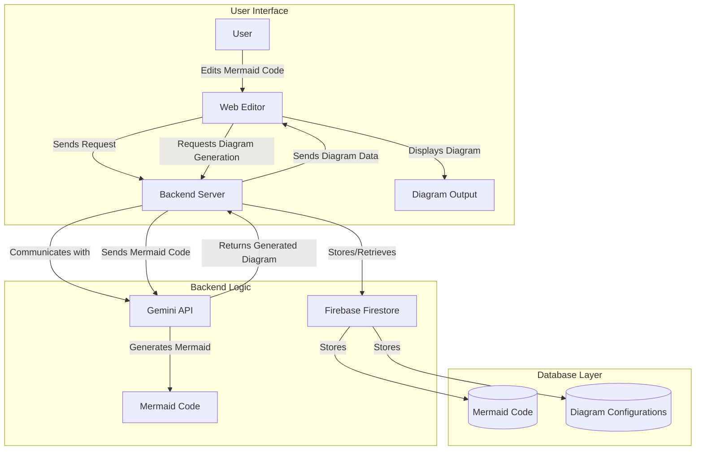

# Flowcraft

Flowcraft is a Mermaid based diagram editor that allows you to create and edit diagrams in real-time. It is a web-based application that can be accessed from any device with a web browser. Flowcraft is designed to be easy to use and intuitive, so you can create professional-looking diagrams quickly and easily.

# Architecture

# Technologies
- **Frontend**: React, Vite, TypeScript, Vanilla CSS
- **Backend**: Node.js, Express, TypeScript
- **Database**: Firebase Firestore
- **AI**: Google Gemini Pro, Groq (Llama 3)
- **Deployment**: Google Cloud Run

# Deployments and URLS
- **Client URL**: [https://flowcraft.ai](https://flowcraft.ai)
- **Server URL**: [https://api.flowcraft.ai](https://api.flowcraft.ai)