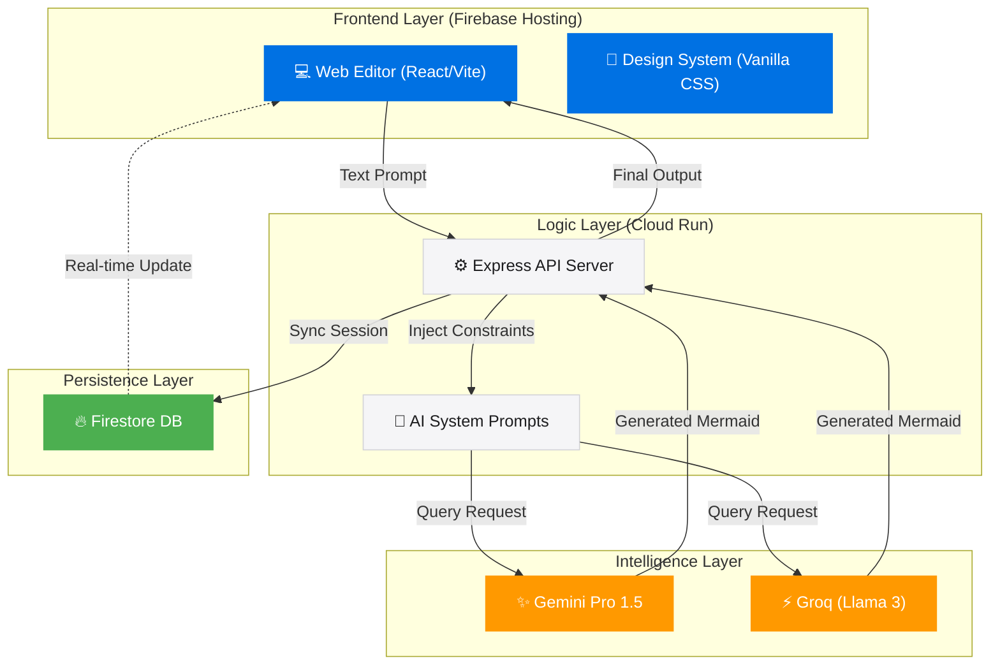

# 🪄 Flowcraft AI

[](https://flowcraft.ai)
[](https://cloud.google.com/run)
[](https://ai.google.dev)

Flowcraft is a **premium, AI-native diagramming engine** that transforms natural language and complex logic into beautiful, structured Mermaid.js diagrams. Designed for speed, precision, and architectural excellence.

---

## ✨ Strategic Features

- 🧠 **AI-Native Orchestration**: Leverages Google Gemini Pro and Groq (Llama 3) to generate accurate diagrams from simple text prompts.
- ⚡ **Real-Time Collaboration**: Powered by Firebase Firestore, ensuring your diagrams are synchronized across all devices instantly.
- 🏗️ **Architectural Insights**: Not just a generator—Flowcraft analyzes your diagrams to provide deep architectural advice and optimization tips.
- 🚀 **CI/CD Ready**: Fully automated deployment pipeline using GitHub Actions, Google Cloud Run, and Firebase Hosting.

---

## 🏗️ Technical Architecture



---

## 🚀 Quick Start

### Local Development

1. **Clone the repository:**
   ```bash
   git clone https://github.com/your-repo/flowcraft.git
   cd flowcraft
   ```

2. **Setup Server:**
   ```bash
   cd server
   cp .env.example .env  # Add your GEMINI_API_KEY
   npm install
   npm run dev
   ```

3. **Setup Client:**
   ```bash
   cd ../client
   npm install
   npm run dev
   ```

---

## 🌐 Deployments

| Component | Host | URL |
| :--- | :--- | :--- |
| **Production Frontend** | Firebase Hosting | [https://flowcraft-95bf4.web.app/](https://flowcraft-95bf4.web.app/) |
| **Production Backend** | Google Cloud Run | [https://api-7tdj5m34va-uc.a.run.app](https://api-7tdj5m34va-uc.a.run.app) |

---

## 🛠️ Tech Stack

- **Core**: TypeScript (Full-stack)
- **Frontend**: [React](https://reactjs.org/), [Vite](https://vitejs.dev/)
- **Styling**: Tailwind CSS, Vanilla CSS
- **Backend**: [Node.js](https://nodejs.org/), [Express](https://expressjs.com/)
- **AI Models**: Google Gemini 2.0 Flash, Groq Llama 3.3
- **Infrastructure**: [Google Cloud Platform](https://cloud.google.com/), [Firebase](https://firebase.google.com/)

---
